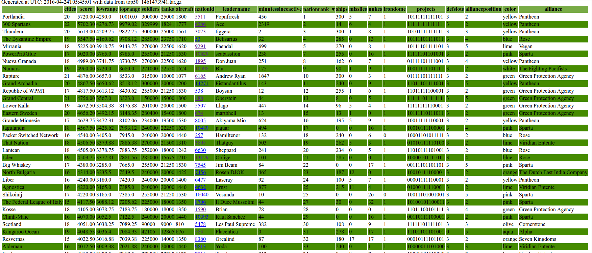
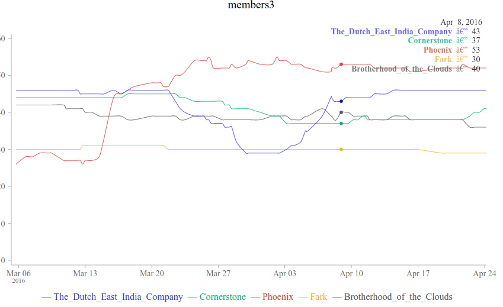

pawstats
--------

This is a collection of scripts used to augment / create some more visualization of the nations and alliances in PAW - ( https://politicsandwar.com/ ).

The scripts are not the best they can be, but they do work (well enough). Initially they were a reason for me to learn some python, some JSON data mangling and then some D3.js visualization. I'm sure there are plenty of optimization to be done. 

Some of the scripts read the API or parse the game's website itself, make some JSON and then write those JSON files to disk. Some other of the scripts use these JSON files to make tables, graphs or make other JSON files.

demos
-----

Part of the top50 table:

One of the members graphs:

grab_stats.py
-------------

 - grab_stats.py #
  - grab data from the game's API or web servers and store in .json files 
  - inject some useful stuff into the files like timestamps for when they were gathered

Arguments:
<pre>
$ python grab_stats.py --help
usage: grab_stats.py [-h] [--version] --outdir out [out ...] [--cities]
                     --sleep sleep [sleep ...] [--top50] [--debug]
                     [--alliance chosen_alliance [chosen_alliance ...]]
                     [--extract] [--merge] [--json]

Make JSON from PAW

optional arguments:
  -h, --help            show this help message and exit
  --version             show program's version number and exit
  --outdir out [out ...]
                        Where to store the JSON
  --cities              Grab cities data
  --sleep sleep [sleep ...]
                        How long to sleep between requests
  --top50               Grab the top50 too
  --debug               Enable Debug?
  --alliance chosen_alliance [chosen_alliance ...]
                        Which alliance to get all the member details from.
                        Like alliance1,alliance+with+spaces
  --extract             Extract members to outdir too
  --merge               Merge
  --json                Set this to false to not write to .json files
</pre>

Example usage - put this in a bash script:
<pre>
#!/bin/bash
scriptdir="$HOME/pawstats"
tmpdir=$(mktemp -d)
python $scriptdir/grab_stats.py --outdir $tmpdir --cities --sleep 1.00 --top50 --alliance "your+alliance+name+here" --json
</pre>

Then go look in $tmpdir - there will be lots of json files.

maketable.py
------------

Uses data from grab_stats.py to make a sortable html table

Have some hardcoded settings inside (path to tarballs and alliance id to include)

Usage:

<pre>
python maketable.py > index.html
</pre>

makegraph.py
------------

Uses data from grab_stats.py to make a bunch of JSON files. One JSON file per graph, like soldiers_0.json

Have some hardcoded settings inside (path to tarballs)

These we can later call with javascript on an html to make pretty graphs with labeling.

Uses http://metricsgraphicsjs.org/ (which sources to get are in the members.html)

Tested with v2.7.0 and v2.9.0 of metricsgraphicsjs and 3.5.10 of D3.js

See members.html for an example of how the .html can look.

Author Information
------------------
